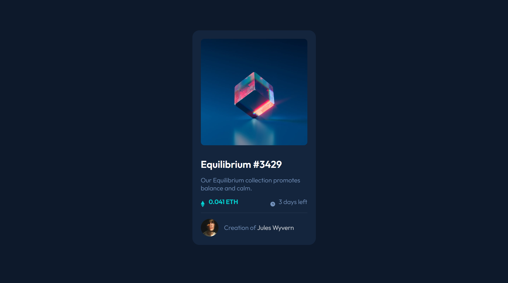

# Frontend Mentor - NFT preview card component solution

This is a solution to the [NFT preview card component challenge on Frontend Mentor](https://www.frontendmentor.io/challenges/nft-preview-card-component-SbdUL_w0U). Frontend Mentor challenges help you improve your coding skills by building realistic projects.

## Table of contents

- [Overview](#overview)
  - [The challenge](#the-challenge)
  - [Screenshot](#screenshot)
  - [Links](#links)
- [My process](#my-process)
  - [Built with](#built-with)
  - [What I learned](#what-i-learned)
- [Author](#author)

## Overview

### The challenge

Users should be able to:

- View the optimal layout depending on their device's screen size
- See hover states for interactive elements

### Screenshot

### Links

- Solution URL: [Add solution URL here](https://your-solution-url.com)
- Live Site URL: [Add live site URL here](https://esealli.github.io/frontend-playground/fem-nft-previw-card)

## My process

### Built with

- Semantic HTML5 markup
- CSS custom properties
- CSS Flex
- Mobile-first workflow

### What I learned

You cannot use CSS ::after on the image tag because img is a void element and its content model never allows it to have contents under any circumstances. Insteag i used a picture tag which is more flexibile and helps with responsive images.

## Author

- Website - [Eseoghene Alli](https://esealli.github.io/)
- Frontend Mentor - [@yourusername](https://www.frontendmentor.io/profile/EseAlli)
